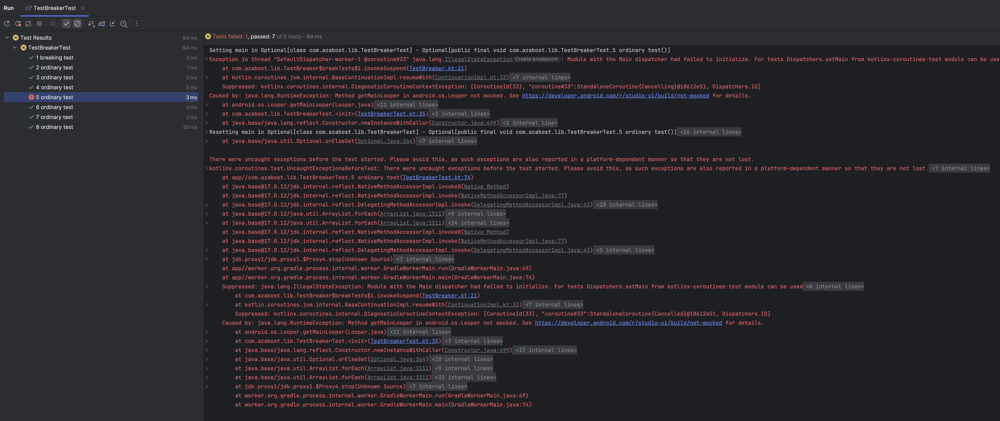

Run `./gradlew :lib:testDebugUnitTest`

<details><summary>Click to expand</summary>

```
kotlinx.coroutines.test.UncaughtExceptionsBeforeTest: There were uncaught exceptions before the test started. Please avoid this, as such exceptions are also reported in a platform-dependent manner so that they are not lost.
	at app//kotlinx.coroutines.test.TestScopeImpl.enter(TestScope.kt:238)
	at app//kotlinx.coroutines.test.TestBuildersKt__TestBuildersKt.runTest-8Mi8wO0(TestBuilders.kt:309)
	at app//kotlinx.coroutines.test.TestBuildersKt.runTest-8Mi8wO0(Unknown Source)
	at app//kotlinx.coroutines.test.TestBuildersKt__TestBuildersKt.runTest-8Mi8wO0(TestBuilders.kt:168)
	at app//kotlinx.coroutines.test.TestBuildersKt.runTest-8Mi8wO0(Unknown Source)
	at app//kotlinx.coroutines.test.TestBuildersKt__TestBuildersKt.runTest-8Mi8wO0$default(TestBuilders.kt:160)
	at app//kotlinx.coroutines.test.TestBuildersKt.runTest-8Mi8wO0$default(Unknown Source)
	at app//com.azabost.lib.TestBreakerTest.5 ordinary test(TestBreakerTest.kt:62)
	at java.base@17.0.12/jdk.internal.reflect.NativeMethodAccessorImpl.invoke0(Native Method)
	at java.base@17.0.12/jdk.internal.reflect.NativeMethodAccessorImpl.invoke(NativeMethodAccessorImpl.java:77)
	at java.base@17.0.12/jdk.internal.reflect.DelegatingMethodAccessorImpl.invoke(DelegatingMethodAccessorImpl.java:43)
	at java.base@17.0.12/java.lang.reflect.Method.invoke(Method.java:568)
	at app//org.junit.platform.commons.util.ReflectionUtils.invokeMethod(ReflectionUtils.java:766)
	at app//org.junit.jupiter.engine.execution.MethodInvocation.proceed(MethodInvocation.java:60)
	at app//org.junit.jupiter.engine.execution.InvocationInterceptorChain$ValidatingInvocation.proceed(InvocationInterceptorChain.java:131)
	at app//org.junit.jupiter.engine.extension.TimeoutExtension.intercept(TimeoutExtension.java:156)
	at app//org.junit.jupiter.engine.extension.TimeoutExtension.interceptTestableMethod(TimeoutExtension.java:147)
	at app//org.junit.jupiter.engine.extension.TimeoutExtension.interceptTestMethod(TimeoutExtension.java:86)
	at app//org.junit.jupiter.engine.execution.InterceptingExecutableInvoker$ReflectiveInterceptorCall.lambda$ofVoidMethod$0(InterceptingExecutableInvoker.java:103)
	at app//org.junit.jupiter.engine.execution.InterceptingExecutableInvoker.lambda$invoke$0(InterceptingExecutableInvoker.java:93)
	at app//org.junit.jupiter.engine.execution.InvocationInterceptorChain$InterceptedInvocation.proceed(InvocationInterceptorChain.java:106)
	at app//org.junit.jupiter.engine.execution.InvocationInterceptorChain.proceed(InvocationInterceptorChain.java:64)
	at app//org.junit.jupiter.engine.execution.InvocationInterceptorChain.chainAndInvoke(InvocationInterceptorChain.java:45)
	at app//org.junit.jupiter.engine.execution.InvocationInterceptorChain.invoke(InvocationInterceptorChain.java:37)
	at app//org.junit.jupiter.engine.execution.InterceptingExecutableInvoker.invoke(InterceptingExecutableInvoker.java:92)
	at app//org.junit.jupiter.engine.execution.InterceptingExecutableInvoker.invoke(InterceptingExecutableInvoker.java:86)
	at app//org.junit.jupiter.engine.descriptor.TestMethodTestDescriptor.lambda$invokeTestMethod$8(TestMethodTestDescriptor.java:217)
	at app//org.junit.platform.engine.support.hierarchical.ThrowableCollector.execute(ThrowableCollector.java:73)
	at app//org.junit.jupiter.engine.descriptor.TestMethodTestDescriptor.invokeTestMethod(TestMethodTestDescriptor.java:213)
	at app//org.junit.jupiter.engine.descriptor.TestMethodTestDescriptor.execute(TestMethodTestDescriptor.java:138)
	at app//org.junit.jupiter.engine.descriptor.TestMethodTestDescriptor.execute(TestMethodTestDescriptor.java:68)
	at app//org.junit.platform.engine.support.hierarchical.NodeTestTask.lambda$executeRecursively$6(NodeTestTask.java:156)
	at app//org.junit.platform.engine.support.hierarchical.ThrowableCollector.execute(ThrowableCollector.java:73)
	at app//org.junit.platform.engine.support.hierarchical.NodeTestTask.lambda$executeRecursively$8(NodeTestTask.java:146)
	at app//org.junit.platform.engine.support.hierarchical.Node.around(Node.java:137)
	at app//org.junit.platform.engine.support.hierarchical.NodeTestTask.lambda$executeRecursively$9(NodeTestTask.java:144)
	at app//org.junit.platform.engine.support.hierarchical.ThrowableCollector.execute(ThrowableCollector.java:73)
	at app//org.junit.platform.engine.support.hierarchical.NodeTestTask.executeRecursively(NodeTestTask.java:143)
	at app//org.junit.platform.engine.support.hierarchical.NodeTestTask.execute(NodeTestTask.java:100)
	at java.base@17.0.12/java.util.ArrayList.forEach(ArrayList.java:1511)
	at app//org.junit.platform.engine.support.hierarchical.SameThreadHierarchicalTestExecutorService.invokeAll(SameThreadHierarchicalTestExecutorService.java:41)
	at app//org.junit.platform.engine.support.hierarchical.NodeTestTask.lambda$executeRecursively$6(NodeTestTask.java:160)
	at app//org.junit.platform.engine.support.hierarchical.ThrowableCollector.execute(ThrowableCollector.java:73)
	at app//org.junit.platform.engine.support.hierarchical.NodeTestTask.lambda$executeRecursively$8(NodeTestTask.java:146)
	at app//org.junit.platform.engine.support.hierarchical.Node.around(Node.java:137)
	at app//org.junit.platform.engine.support.hierarchical.NodeTestTask.lambda$executeRecursively$9(NodeTestTask.java:144)
	at app//org.junit.platform.engine.support.hierarchical.ThrowableCollector.execute(ThrowableCollector.java:73)
	at app//org.junit.platform.engine.support.hierarchical.NodeTestTask.executeRecursively(NodeTestTask.java:143)
	at app//org.junit.platform.engine.support.hierarchical.NodeTestTask.execute(NodeTestTask.java:100)
	at java.base@17.0.12/java.util.ArrayList.forEach(ArrayList.java:1511)
	at app//org.junit.platform.engine.support.hierarchical.SameThreadHierarchicalTestExecutorService.invokeAll(SameThreadHierarchicalTestExecutorService.java:41)
	at app//org.junit.platform.engine.support.hierarchical.NodeTestTask.lambda$executeRecursively$6(NodeTestTask.java:160)
	at app//org.junit.platform.engine.support.hierarchical.ThrowableCollector.execute(ThrowableCollector.java:73)
	at app//org.junit.platform.engine.support.hierarchical.NodeTestTask.lambda$executeRecursively$8(NodeTestTask.java:146)
	at app//org.junit.platform.engine.support.hierarchical.Node.around(Node.java:137)
	at app//org.junit.platform.engine.support.hierarchical.NodeTestTask.lambda$executeRecursively$9(NodeTestTask.java:144)
	at app//org.junit.platform.engine.support.hierarchical.ThrowableCollector.execute(ThrowableCollector.java:73)
	at app//org.junit.platform.engine.support.hierarchical.NodeTestTask.executeRecursively(NodeTestTask.java:143)
	at app//org.junit.platform.engine.support.hierarchical.NodeTestTask.execute(NodeTestTask.java:100)
	at app//org.junit.platform.engine.support.hierarchical.SameThreadHierarchicalTestExecutorService.submit(SameThreadHierarchicalTestExecutorService.java:35)
	at app//org.junit.platform.engine.support.hierarchical.HierarchicalTestExecutor.execute(HierarchicalTestExecutor.java:57)
	at app//org.junit.platform.engine.support.hierarchical.HierarchicalTestEngine.execute(HierarchicalTestEngine.java:54)
	at app//org.junit.platform.launcher.core.EngineExecutionOrchestrator.execute(EngineExecutionOrchestrator.java:107)
	at app//org.junit.platform.launcher.core.EngineExecutionOrchestrator.execute(EngineExecutionOrchestrator.java:88)
	at app//org.junit.platform.launcher.core.EngineExecutionOrchestrator.lambda$execute$0(EngineExecutionOrchestrator.java:54)
	at app//org.junit.platform.launcher.core.EngineExecutionOrchestrator.withInterceptedStreams(EngineExecutionOrchestrator.java:67)
	at app//org.junit.platform.launcher.core.EngineExecutionOrchestrator.execute(EngineExecutionOrchestrator.java:52)
	at app//org.junit.platform.launcher.core.DefaultLauncher.execute(DefaultLauncher.java:114)
	at app//org.junit.platform.launcher.core.DefaultLauncher.execute(DefaultLauncher.java:86)
	at app//org.junit.platform.launcher.core.DefaultLauncherSession$DelegatingLauncher.execute(DefaultLauncherSession.java:86)
	at org.gradle.api.internal.tasks.testing.junitplatform.JUnitPlatformTestClassProcessor$CollectAllTestClassesExecutor.processAllTestClasses(JUnitPlatformTestClassProcessor.java:124)
	at org.gradle.api.internal.tasks.testing.junitplatform.JUnitPlatformTestClassProcessor$CollectAllTestClassesExecutor.access$000(JUnitPlatformTestClassProcessor.java:99)
	at org.gradle.api.internal.tasks.testing.junitplatform.JUnitPlatformTestClassProcessor.stop(JUnitPlatformTestClassProcessor.java:94)
	at org.gradle.api.internal.tasks.testing.SuiteTestClassProcessor.stop(SuiteTestClassProcessor.java:63)
	at java.base@17.0.12/jdk.internal.reflect.NativeMethodAccessorImpl.invoke0(Native Method)
	at java.base@17.0.12/jdk.internal.reflect.NativeMethodAccessorImpl.invoke(NativeMethodAccessorImpl.java:77)
	at java.base@17.0.12/jdk.internal.reflect.DelegatingMethodAccessorImpl.invoke(DelegatingMethodAccessorImpl.java:43)
	at java.base@17.0.12/java.lang.reflect.Method.invoke(Method.java:568)
	at org.gradle.internal.dispatch.ReflectionDispatch.dispatch(ReflectionDispatch.java:36)
	at org.gradle.internal.dispatch.ReflectionDispatch.dispatch(ReflectionDispatch.java:24)
	at org.gradle.internal.dispatch.ContextClassLoaderDispatch.dispatch(ContextClassLoaderDispatch.java:33)
	at org.gradle.internal.dispatch.ProxyDispatchAdapter$DispatchingInvocationHandler.invoke(ProxyDispatchAdapter.java:92)
	at jdk.proxy1/jdk.proxy1.$Proxy4.stop(Unknown Source)
	at org.gradle.api.internal.tasks.testing.worker.TestWorker$3.run(TestWorker.java:200)
	at org.gradle.api.internal.tasks.testing.worker.TestWorker.executeAndMaintainThreadName(TestWorker.java:132)
	at org.gradle.api.internal.tasks.testing.worker.TestWorker.execute(TestWorker.java:103)
	at org.gradle.api.internal.tasks.testing.worker.TestWorker.execute(TestWorker.java:63)
	at org.gradle.process.internal.worker.child.ActionExecutionWorker.execute(ActionExecutionWorker.java:56)
	at org.gradle.process.internal.worker.child.SystemApplicationClassLoaderWorker.call(SystemApplicationClassLoaderWorker.java:121)
	at org.gradle.process.internal.worker.child.SystemApplicationClassLoaderWorker.call(SystemApplicationClassLoaderWorker.java:71)
	at app//worker.org.gradle.process.internal.worker.GradleWorkerMain.run(GradleWorkerMain.java:69)
	at app//worker.org.gradle.process.internal.worker.GradleWorkerMain.main(GradleWorkerMain.java:74)
	Suppressed: java.lang.IllegalStateException: Module with the Main dispatcher had failed to initialize. For tests Dispatchers.setMain from kotlinx-coroutines-test module can be used
		at kotlinx.coroutines.internal.MissingMainCoroutineDispatcher.missing(MainDispatchers.kt:111)
		at kotlinx.coroutines.internal.MissingMainCoroutineDispatcher.isDispatchNeeded(MainDispatchers.kt:92)
		at kotlinx.coroutines.test.internal.TestMainDispatcher.isDispatchNeeded(TestMainDispatcher.kt:27)
		at kotlinx.coroutines.internal.DispatchedContinuationKt.resumeCancellableWith(DispatchedContinuation.kt:315)
		at kotlinx.coroutines.intrinsics.CancellableKt.startCoroutineCancellable(Cancellable.kt:26)
		at kotlinx.coroutines.intrinsics.CancellableKt.startCoroutineCancellable$default(Cancellable.kt:21)
		at kotlinx.coroutines.BuildersKt__Builders_commonKt.withContext(Builders.common.kt:168)
		at kotlinx.coroutines.BuildersKt.withContext(Unknown Source)
		at com.azabost.lib.TestBreaker$breakTests$1.invokeSuspend(TestBreaker.kt:21)
		at kotlin.coroutines.jvm.internal.BaseContinuationImpl.resumeWith(ContinuationImpl.kt:33)
		at kotlinx.coroutines.DispatchedTask.run(DispatchedTask.kt:104)
		at kotlinx.coroutines.internal.LimitedDispatcher$Worker.run(LimitedDispatcher.kt:111)
		at kotlinx.coroutines.scheduling.TaskImpl.run(Tasks.kt:99)
		at kotlinx.coroutines.scheduling.CoroutineScheduler.runSafely(CoroutineScheduler.kt:584)
		at kotlinx.coroutines.scheduling.CoroutineScheduler$Worker.executeTask(CoroutineScheduler.kt:811)
		at kotlinx.coroutines.scheduling.CoroutineScheduler$Worker.runWorker(CoroutineScheduler.kt:715)
		at kotlinx.coroutines.scheduling.CoroutineScheduler$Worker.run(CoroutineScheduler.kt:702)
		Suppressed: kotlinx.coroutines.internal.DiagnosticCoroutineContextException: [CoroutineId(33), "coroutine#33":StandaloneCoroutine{Cancelled}@19db5c7e, Dispatchers.IO]
	Caused by: java.lang.RuntimeException: Method getMainLooper in android.os.Looper not mocked. See https://developer.android.com/r/studio-ui/build/not-mocked for details.
		at android.os.Looper.getMainLooper(Looper.java)
		at kotlinx.coroutines.android.AndroidDispatcherFactory.createDispatcher(HandlerDispatcher.kt:51)
		at kotlinx.coroutines.internal.MainDispatchersKt.tryCreateDispatcher(MainDispatchers.kt:53)
		at kotlinx.coroutines.test.internal.TestMainDispatcherFactory.createDispatcher(TestMainDispatcherJvm.kt:11)
		at kotlinx.coroutines.internal.MainDispatchersKt.tryCreateDispatcher(MainDispatchers.kt:53)
		at kotlinx.coroutines.internal.MainDispatcherLoader.loadMainDispatcher(MainDispatchers.kt:34)
		at kotlinx.coroutines.internal.MainDispatcherLoader.<clinit>(MainDispatchers.kt:18)
		at kotlinx.coroutines.Dispatchers.getMain(Dispatchers.kt:20)
		at kotlinx.coroutines.test.internal.TestMainDispatcher$Companion.getCurrentTestDispatcher$kotlinx_coroutines_test(TestMainDispatcher.kt:47)
		at kotlinx.coroutines.test.internal.TestMainDispatcher$Companion.getCurrentTestScheduler$kotlinx_coroutines_test(TestMainDispatcher.kt:50)
		at kotlinx.coroutines.test.TestCoroutineDispatchersKt.UnconfinedTestDispatcher(TestCoroutineDispatchers.kt:83)
		at kotlinx.coroutines.test.TestCoroutineDispatchersKt.UnconfinedTestDispatcher$default(TestCoroutineDispatchers.kt:79)
		at com.azabost.lib.TestBreakerTest.<init>(TestBreakerTest.kt:34)
		at java.base/jdk.internal.reflect.NativeConstructorAccessorImpl.newInstance0(Native Method)
		at java.base/jdk.internal.reflect.NativeConstructorAccessorImpl.newInstance(NativeConstructorAccessorImpl.java:77)
		at java.base/jdk.internal.reflect.DelegatingConstructorAccessorImpl.newInstance(DelegatingConstructorAccessorImpl.java:45)
		at java.base/java.lang.reflect.Constructor.newInstanceWithCaller(Constructor.java:499)
		at java.base/java.lang.reflect.Constructor.newInstance(Constructor.java:480)
		at org.junit.platform.commons.util.ReflectionUtils.newInstance(ReflectionUtils.java:591)
		at org.junit.jupiter.engine.execution.ConstructorInvocation.proceed(ConstructorInvocation.java:56)
		at org.junit.jupiter.engine.execution.InvocationInterceptorChain$ValidatingInvocation.proceed(InvocationInterceptorChain.java:131)
		at org.junit.jupiter.api.extension.InvocationInterceptor.interceptTestClassConstructor(InvocationInterceptor.java:73)
		at org.junit.jupiter.engine.execution.InterceptingExecutableInvoker.lambda$invoke$0(InterceptingExecutableInvoker.java:93)
		at org.junit.jupiter.engine.execution.InvocationInterceptorChain$InterceptedInvocation.proceed(InvocationInterceptorChain.java:106)
		at org.junit.jupiter.engine.execution.InvocationInterceptorChain.proceed(InvocationInterceptorChain.java:64)
		at org.junit.jupiter.engine.execution.InvocationInterceptorChain.chainAndInvoke(InvocationInterceptorChain.java:45)
		at org.junit.jupiter.engine.execution.InvocationInterceptorChain.invoke(InvocationInterceptorChain.java:37)
		at org.junit.jupiter.engine.execution.InterceptingExecutableInvoker.invoke(InterceptingExecutableInvoker.java:92)
		at org.junit.jupiter.engine.execution.InterceptingExecutableInvoker.invoke(InterceptingExecutableInvoker.java:62)
		at org.junit.jupiter.engine.descriptor.ClassBasedTestDescriptor.invokeTestClassConstructor(ClassBasedTestDescriptor.java:364)
		at org.junit.jupiter.engine.descriptor.ClassBasedTestDescriptor.instantiateTestClass(ClassBasedTestDescriptor.java:311)
		at org.junit.jupiter.engine.descriptor.ClassTestDescriptor.instantiateTestClass(ClassTestDescriptor.java:79)
		at org.junit.jupiter.engine.descriptor.ClassBasedTestDescriptor.instantiateAndPostProcessTestInstance(ClassBasedTestDescriptor.java:287)
		at org.junit.jupiter.engine.descriptor.ClassBasedTestDescriptor.lambda$testInstancesProvider$5(ClassBasedTestDescriptor.java:279)
		at java.base/java.util.Optional.orElseGet(Optional.java:364)
		at org.junit.jupiter.engine.descriptor.ClassBasedTestDescriptor.lambda$testInstancesProvider$6(ClassBasedTestDescriptor.java:278)
		at org.junit.jupiter.engine.execution.TestInstancesProvider.getTestInstances(TestInstancesProvider.java:31)
		at org.junit.jupiter.engine.descriptor.TestMethodTestDescriptor.lambda$prepare$1(TestMethodTestDescriptor.java:105)
		at org.junit.platform.engine.support.hierarchical.ThrowableCollector.execute(ThrowableCollector.java:73)
		at org.junit.jupiter.engine.descriptor.TestMethodTestDescriptor.prepare(TestMethodTestDescriptor.java:104)
		at org.junit.jupiter.engine.descriptor.TestMethodTestDescriptor.prepare(TestMethodTestDescriptor.java:68)
		at org.junit.platform.engine.support.hierarchical.NodeTestTask.lambda$prepare$2(NodeTestTask.java:128)
		at org.junit.platform.engine.support.hierarchical.ThrowableCollector.execute(ThrowableCollector.java:73)
		at org.junit.platform.engine.support.hierarchical.NodeTestTask.prepare(NodeTestTask.java:128)
		at org.junit.platform.engine.support.hierarchical.NodeTestTask.execute(NodeTestTask.java:95)
		at java.base/java.util.ArrayList.forEach(ArrayList.java:1511)
		at org.junit.platform.engine.support.hierarchical.SameThreadHierarchicalTestExecutorService.invokeAll(SameThreadHierarchicalTestExecutorService.java:41)
		at org.junit.platform.engine.support.hierarchical.NodeTestTask.lambda$executeRecursively$6(NodeTestTask.java:160)
		at org.junit.platform.engine.support.hierarchical.ThrowableCollector.execute(ThrowableCollector.java:73)
		at org.junit.platform.engine.support.hierarchical.NodeTestTask.lambda$executeRecursively$8(NodeTestTask.java:146)
		at org.junit.platform.engine.support.hierarchical.Node.around(Node.java:137)
		at org.junit.platform.engine.support.hierarchical.NodeTestTask.lambda$executeRecursively$9(NodeTestTask.java:144)
		at org.junit.platform.engine.support.hierarchical.ThrowableCollector.execute(ThrowableCollector.java:73)
		at org.junit.platform.engine.support.hierarchical.NodeTestTask.executeRecursively(NodeTestTask.java:143)
		at org.junit.platform.engine.support.hierarchical.NodeTestTask.execute(NodeTestTask.java:100)
		at java.base/java.util.ArrayList.forEach(ArrayList.java:1511)
		at org.junit.platform.engine.support.hierarchical.SameThreadHierarchicalTestExecutorService.invokeAll(SameThreadHierarchicalTestExecutorService.java:41)
		at org.junit.platform.engine.support.hierarchical.NodeTestTask.lambda$executeRecursively$6(NodeTestTask.java:160)
		at org.junit.platform.engine.support.hierarchical.ThrowableCollector.execute(ThrowableCollector.java:73)
		at org.junit.platform.engine.support.hierarchical.NodeTestTask.lambda$executeRecursively$8(NodeTestTask.java:146)
		at org.junit.platform.engine.support.hierarchical.Node.around(Node.java:137)
		at org.junit.platform.engine.support.hierarchical.NodeTestTask.lambda$executeRecursively$9(NodeTestTask.java:144)
		at org.junit.platform.engine.support.hierarchical.ThrowableCollector.execute(ThrowableCollector.java:73)
		at org.junit.platform.engine.support.hierarchical.NodeTestTask.executeRecursively(NodeTestTask.java:143)
		at org.junit.platform.engine.support.hierarchical.NodeTestTask.execute(NodeTestTask.java:100)
		at org.junit.platform.engine.support.hierarchical.SameThreadHierarchicalTestExecutorService.submit(SameThreadHierarchicalTestExecutorService.java:35)
		at org.junit.platform.engine.support.hierarchical.HierarchicalTestExecutor.execute(HierarchicalTestExecutor.java:57)
		at org.junit.platform.engine.support.hierarchical.HierarchicalTestEngine.execute(HierarchicalTestEngine.java:54)
		at org.junit.platform.launcher.core.EngineExecutionOrchestrator.execute(EngineExecutionOrchestrator.java:107)
		at org.junit.platform.launcher.core.EngineExecutionOrchestrator.execute(EngineExecutionOrchestrator.java:88)
		at org.junit.platform.launcher.core.EngineExecutionOrchestrator.lambda$execute$0(EngineExecutionOrchestrator.java:54)
		at org.junit.platform.launcher.core.EngineExecutionOrchestrator.withInterceptedStreams(EngineExecutionOrchestrator.java:67)
		at org.junit.platform.launcher.core.EngineExecutionOrchestrator.execute(EngineExecutionOrchestrator.java:52)
		at org.junit.platform.launcher.core.DefaultLauncher.execute(DefaultLauncher.java:114)
		at org.junit.platform.launcher.core.DefaultLauncher.execute(DefaultLauncher.java:86)
		at org.junit.platform.launcher.core.DefaultLauncherSession$DelegatingLauncher.execute(DefaultLauncherSession.java:86)
		at org.gradle.api.internal.tasks.testing.junitplatform.JUnitPlatformTestClassProcessor$CollectAllTestClassesExecutor.processAllTestClasses(JUnitPlatformTestClassProcessor.java:124)
		at org.gradle.api.internal.tasks.testing.junitplatform.JUnitPlatformTestClassProcessor$CollectAllTestClassesExecutor.access$000(JUnitPlatformTestClassProcessor.java:99)
		at org.gradle.api.internal.tasks.testing.junitplatform.JUnitPlatformTestClassProcessor.stop(JUnitPlatformTestClassProcessor.java:94)
		at org.gradle.api.internal.tasks.testing.SuiteTestClassProcessor.stop(SuiteTestClassProcessor.java:63)
		at java.base/jdk.internal.reflect.NativeMethodAccessorImpl.invoke0(Native Method)
		at java.base/jdk.internal.reflect.NativeMethodAccessorImpl.invoke(NativeMethodAccessorImpl.java:77)
		at java.base/jdk.internal.reflect.DelegatingMethodAccessorImpl.invoke(DelegatingMethodAccessorImpl.java:43)
		at java.base/java.lang.reflect.Method.invoke(Method.java:568)
		at org.gradle.internal.dispatch.ReflectionDispatch.dispatch(ReflectionDispatch.java:36)
		at org.gradle.internal.dispatch.ReflectionDispatch.dispatch(ReflectionDispatch.java:24)
		at org.gradle.internal.dispatch.ContextClassLoaderDispatch.dispatch(ContextClassLoaderDispatch.java:33)
		at org.gradle.internal.dispatch.ProxyDispatchAdapter$DispatchingInvocationHandler.invoke(ProxyDispatchAdapter.java:92)
		at jdk.proxy1/jdk.proxy1.$Proxy4.stop(Unknown Source)
		at org.gradle.api.internal.tasks.testing.worker.TestWorker$3.run(TestWorker.java:200)
		at org.gradle.api.internal.tasks.testing.worker.TestWorker.executeAndMaintainThreadName(TestWorker.java:132)
		at org.gradle.api.internal.tasks.testing.worker.TestWorker.execute(TestWorker.java:103)
		at org.gradle.api.internal.tasks.testing.worker.TestWorker.execute(TestWorker.java:63)
		at org.gradle.process.internal.worker.child.ActionExecutionWorker.execute(ActionExecutionWorker.java:56)
		at org.gradle.process.internal.worker.child.SystemApplicationClassLoaderWorker.call(SystemApplicationClassLoaderWorker.java:121)
		at org.gradle.process.internal.worker.child.SystemApplicationClassLoaderWorker.call(SystemApplicationClassLoaderWorker.java:71)
		at worker.org.gradle.process.internal.worker.GradleWorkerMain.run(GradleWorkerMain.java:69)
		at worker.org.gradle.process.internal.worker.GradleWorkerMain.main(GradleWorkerMain.java:74)
```

</details>

